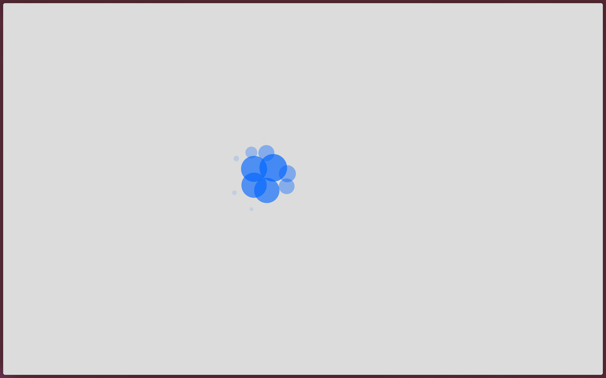

# bubbles

Tiny p5.js sketch creating animated bubbles arranged in a grid. The bubbles react to the mouse when you move over them.

Purpose: practice creating particle-like systems and basic mouse interaction in p5.js.

