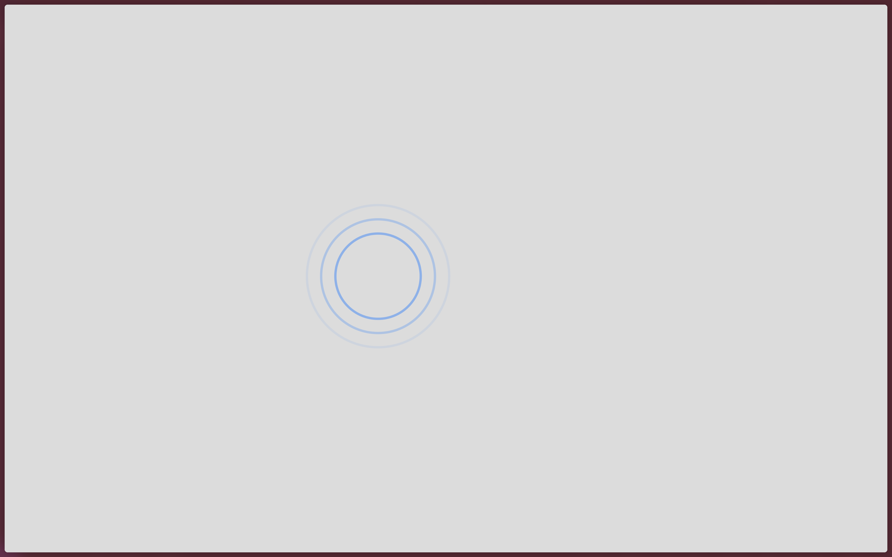

# ripple

Ripple effect p5.js sketch. Open `index.html` to run. Contains `sketch.js`, `style.css`, and `libraries`.

Purpose: visual experiment with ripple animations. When clicking, ripples spread from the mouse position.

