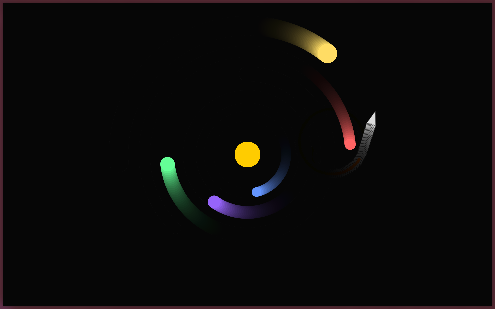

# planets

Planetary orbit simulation/demo using p5.js. Open `index.html` to run.

Purpose: visual study of orbital motion and interactions. Add also the tracing of paths. There is also a rocket that can be controlled with arrow keys.

