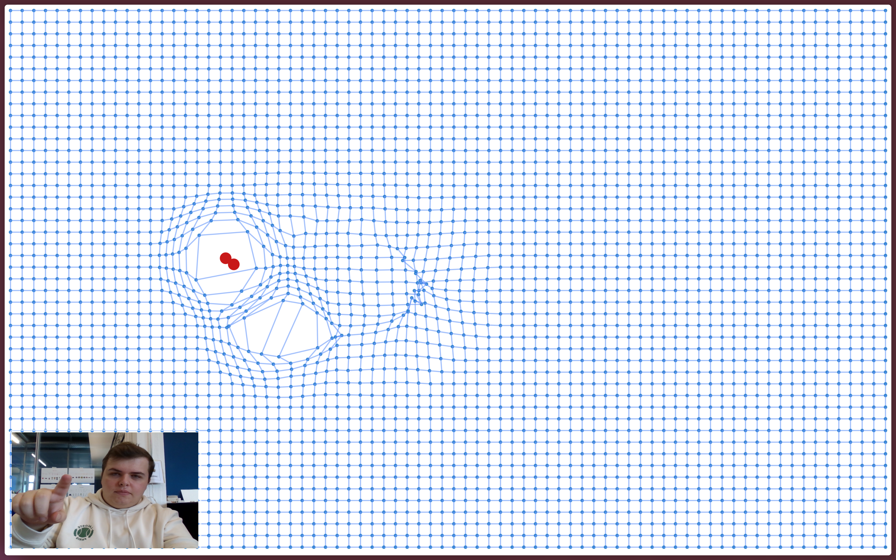

# Magnetic sketch

A p5.js sketch exploring magnetic fields and particle interactions.

Purpose: visualize magnetic field lines and particle movements influenced by magnetic forces using a grid-based system and real-time hand tracking.

