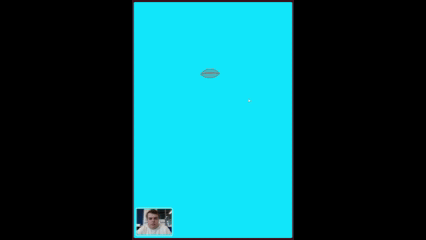

# demo

Demo sketch to test face tracking with MediaPipe and p5.js. Users can interact with the sketch by throwing fire with their mouth and changing colors by blinking.

Purpose: showcase face tracking capabilities using MediaPipe integrated with p5.js.

