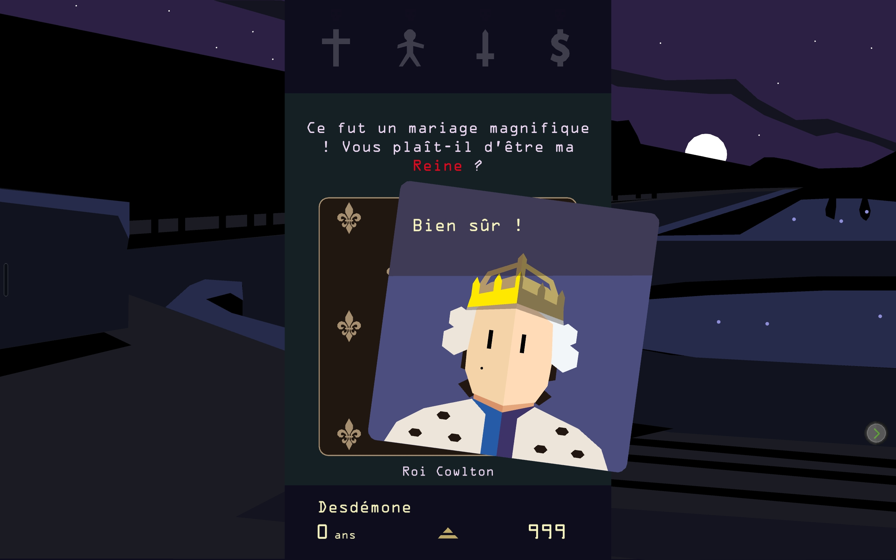
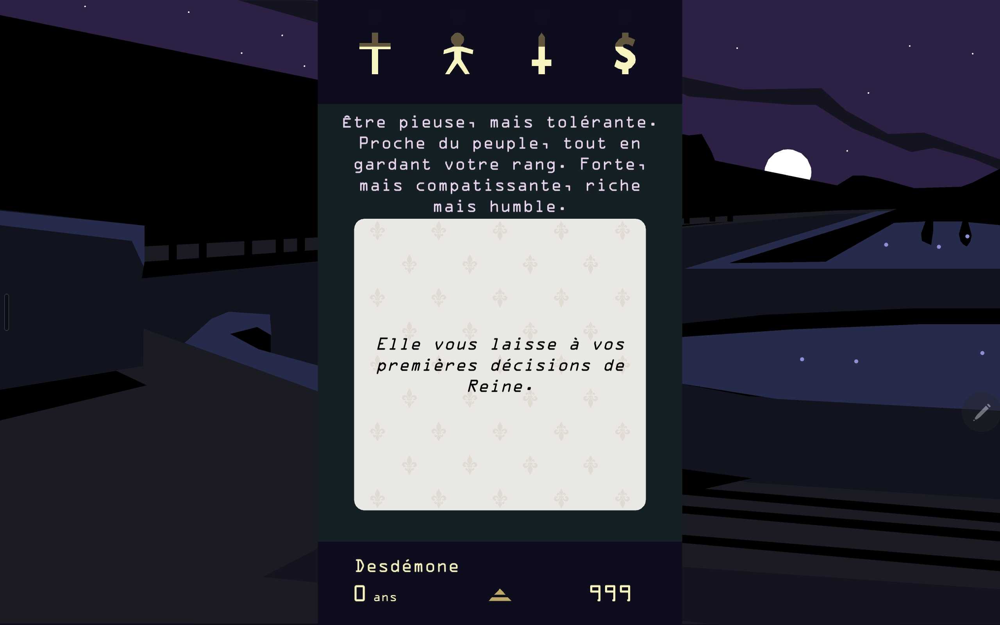
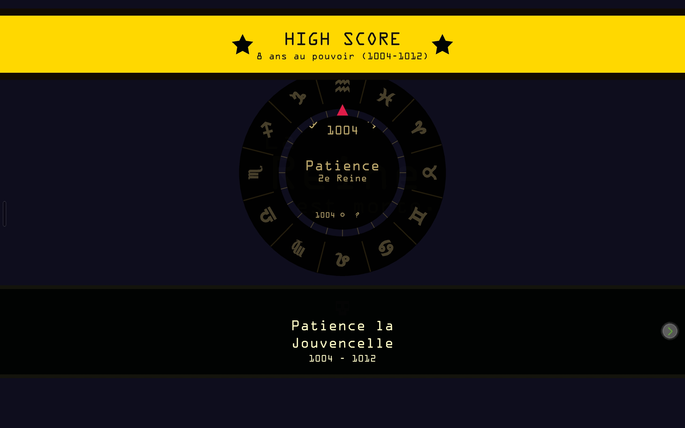
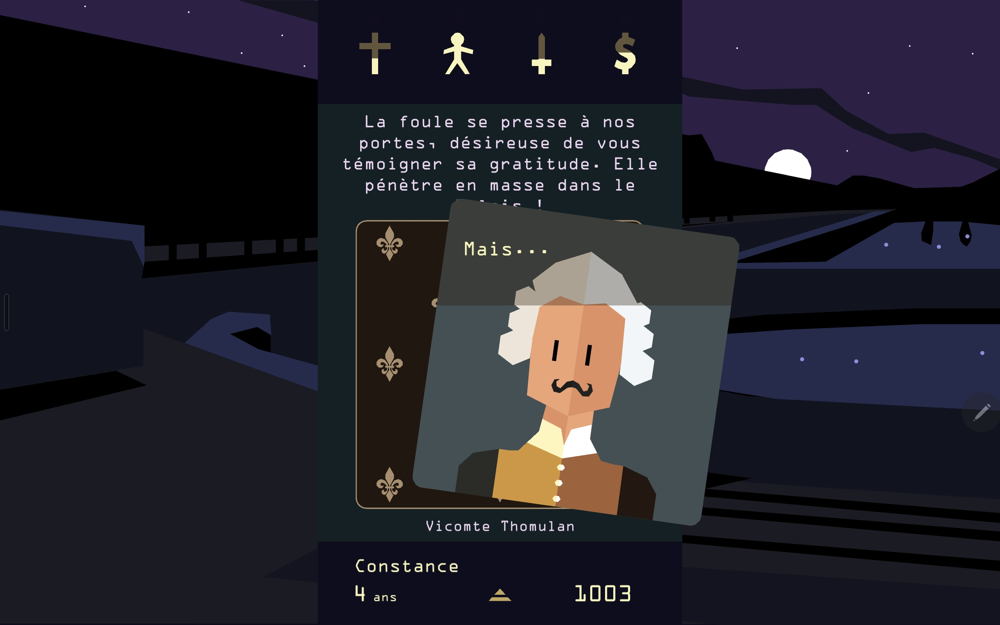
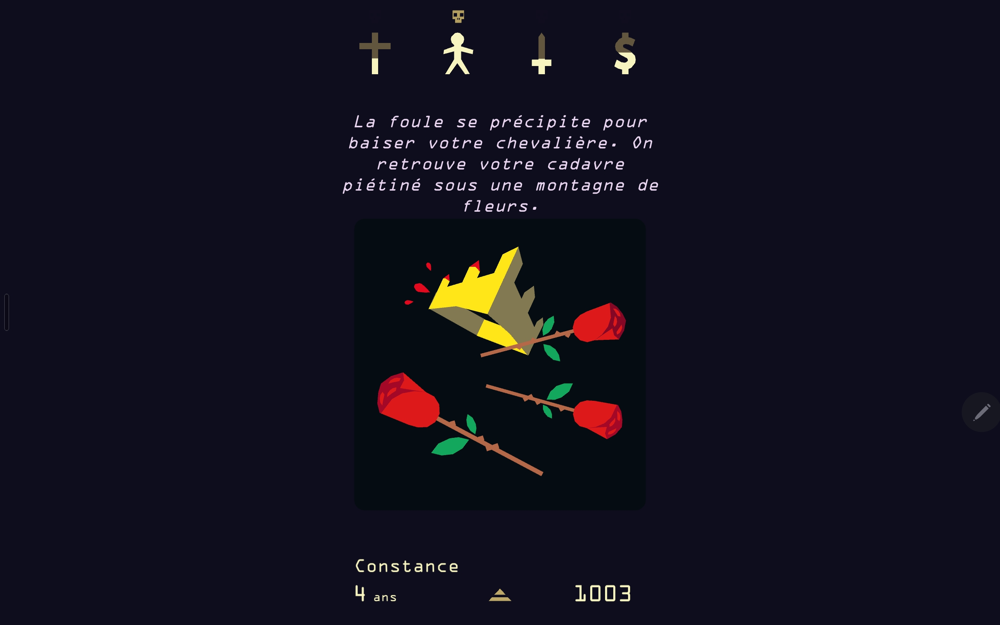

Link - https://store.steampowered.com/app/474750/Reigns/
___
# Onboarding
First time we have a tutorial to tell use how to play.

When we are the context and how to play it says that the game start with texts.

# Visuals
The font use is a bit like computer based.
The design of the cards is flat-design with simple shapes.

# Interactions
We interact with the game by sliding the cards left or right to make a choice that will influances the 4 pillars of our success as a queen.
The feedback that we have come from these pillars that represents church, people, army and money by simbols respectively a cross, a person, a sword and a dollar.
We have mission that we can do and when we realise them a sound of success is played and a bannier is placed on the screen to tell us what we have acconplished. Same as the highscore.

If we make a pillar too strong we loose and die, the game tell us how we died.

# Sounds
The characters has voices even if there just make sound and don't speak with a distinct dialect.
When we die a sound play for the reason of our death.