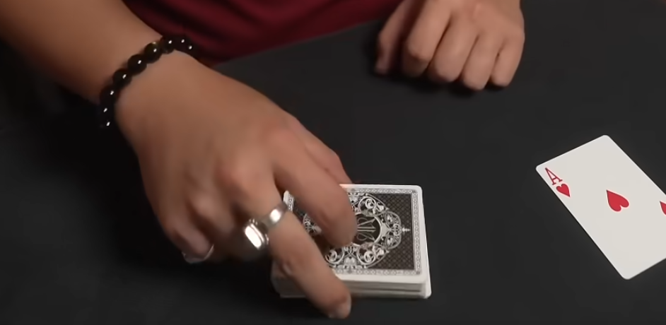

Link - https://www.youtube.com/shorts/oOMj2fYW62Q
___
In the video the person use often 3 fingers to manipulate the cards. Especially when they make manipulation on a table.

They make sound when revealing cards with thumb and the other hand.
The person use often the thumb to manipulate the cards.

Is a trick video so the person make a lot of manipulation with the cards.