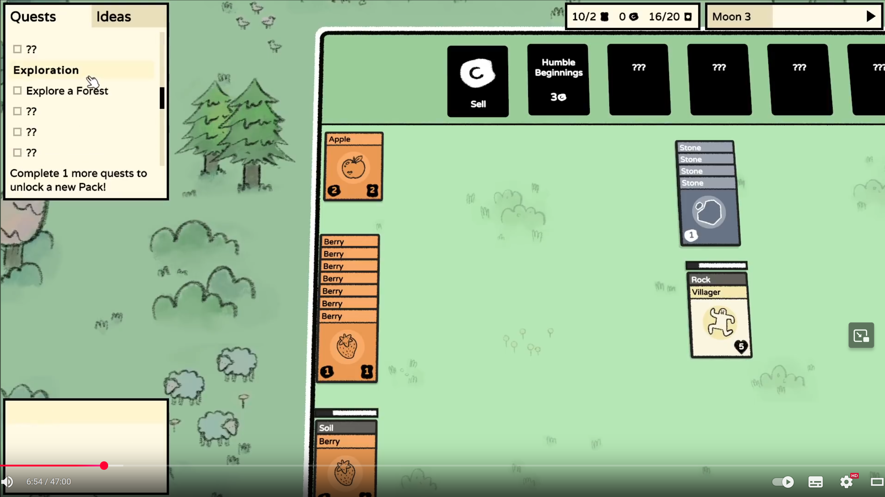
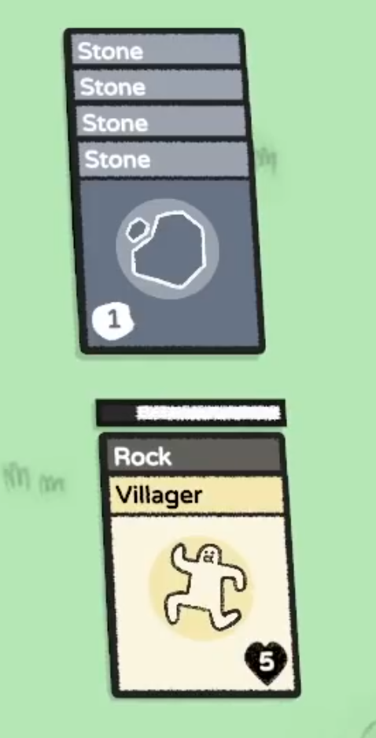
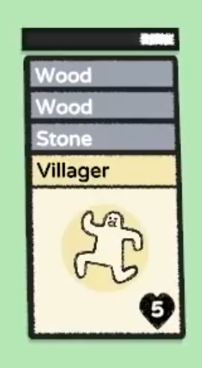

Link - https://www.youtube.com/watch?v=cLrolfKBYg8
___
# Gameplay
The cards can be stacked and for performing action we have to place villagers on the cards.
Then we have ressources that we can use to build more cards or sell them to have more money.
With money we can buy boosters that will provide us with new cards or ressources.
We also have quests that we can do to progress in the game.

# Iteractions
The iteraction is mainly with mouse and we can click and drag cards to stack them or place villagers on them.
On hover we have information about the card or anything else related to the card.

# Visuals
Visually we have a paper like design.
When we stack cards and we put the villager card on it, it add a progress bar that fill with time to show the progress of the action.

# Sounds
When cards are stacked they make a sound of paper/card sliding on each other.
And when we just move a card on the board it make a sound more deep like a card on a table.