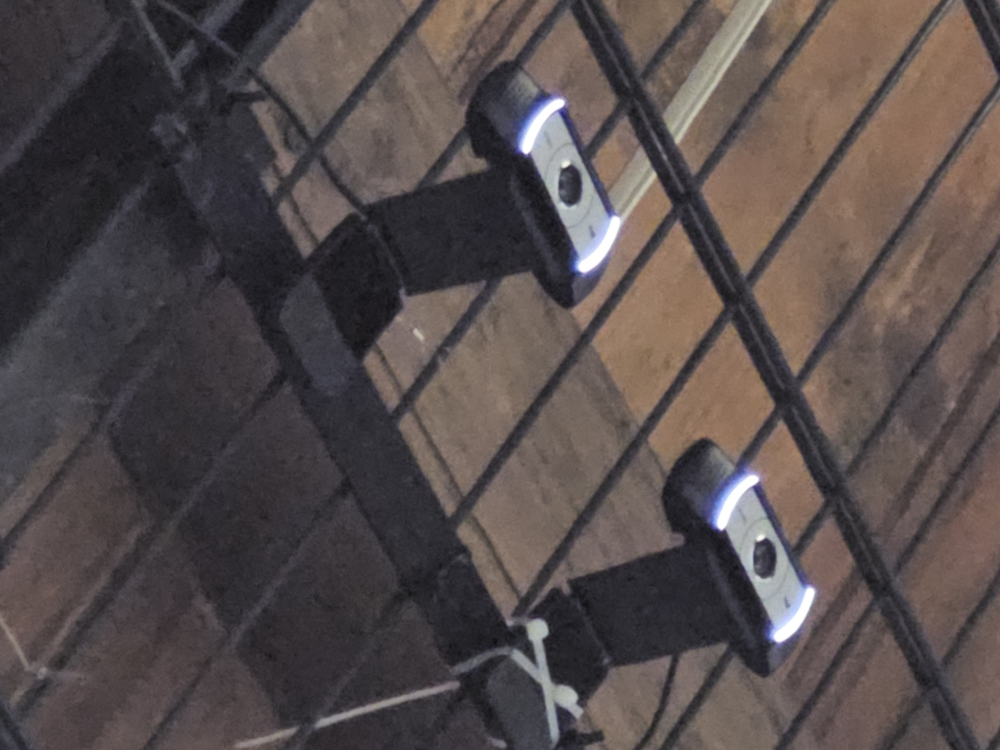

# Notes on museum visit

3 langues Anglais, francais, allemand

Suits= distinctive, identifiy a sub-catégorie on a deck

content of origine and we are in the part of suits (so be general and broad)

50 lux max on cards

sound good (ambient, voice)
- no other sound on the room

listen and read in mancalas (avale) room -> for accessibility

Exhibition for 12 month
- Robuste ordinateur is disponible
- For maintenance is a challenge
	- open 6 days by week

Ideally is to be autonomous (there is Wifi)
- it is unplugged at night
- protocol to lunch installation ok
- people will try to hack en installation
- NB people
- watchable by many people

Idea that target families

If we intergrate something physical
- make sure that is cheap and fast to produce

## Games

Daybreak - good game about climat
Atuel - video game about river

## Images of the museum

<table>
	<tr>
		<td align="center">
			
		</td>
		<td align="center">
			
		</td>
		<td align="center">
			
		</td>
	</tr>
	<tr>
		<td align="center">
			
		</td>
		<td align="center">
			
		</td>
		<td align="center">
			
		</td>
	</tr>
	<tr>
		<td align="center">
			
		</td>
		<td align="center">
			
		</td>
		<td align="center">
			
		</td>
	</tr>
	<tr>
		<td align="center">
			
		</td>
		<td align="center">
			
		</td>
		<td align="center">
			
		</td>
	</tr>
</table>

