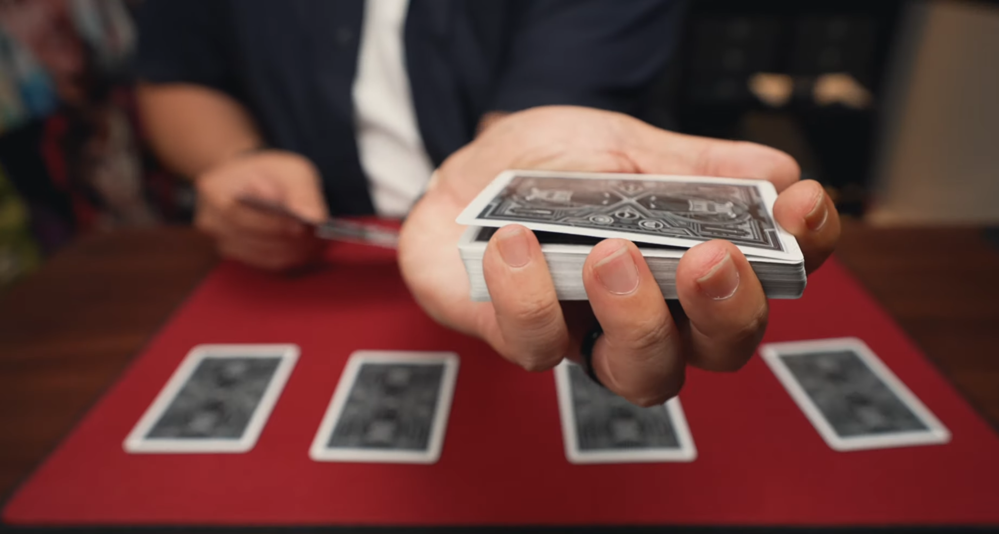

Link - https://www.wikihow.com/Do-Easy-Card-Tricks
        https://www.youtube.com/playlist?list=PLlX3ISPKpXb1JTlo5Kgrjzg6mVTjAvuiH
___
# Magic tricks
The principale is to make the audience believe that we do something but in reality we do something else to trick them think that we do something impossible.
This can be done by hiding some aspects of the trick.

## Exemple
In a youtube video, a guy show how to do a card trick where he make the 4 aces appear on the top of the deck. But in fact he never put them in the middle of the deck but he put them on the top.

