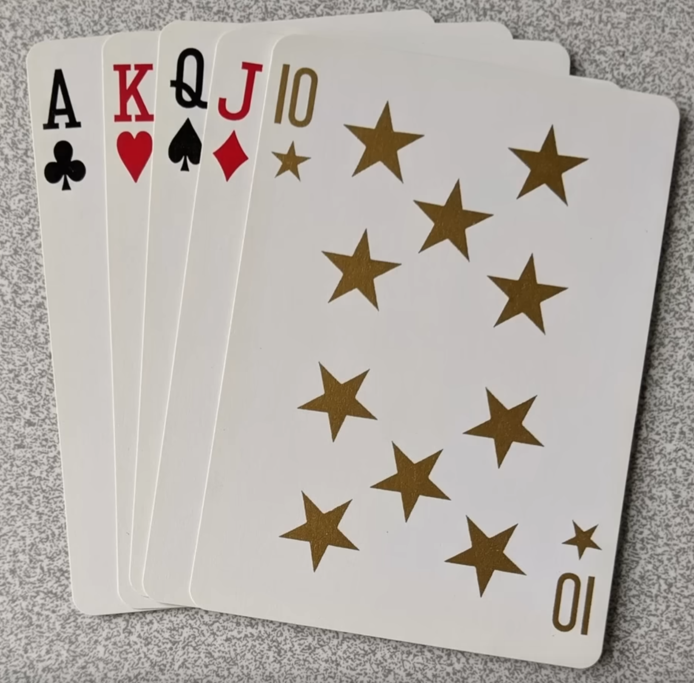

# Fifth Playing Card Suit

link: https://www.youtube.com/watch?v=0IYkYQ_G4Cs

In this video, the person talks about the posibilities of adding a fifth suit to the traditional four playing card suits (hearts, diamonds, clubs, and spades). It talks about diferent ones and also how something it adding 4 more suits to the existing ones so that there is a total of 8 suits.

At the end of the video, he talks about what make a good suits design today, and he mentions that it should be simple, recognizable, and easy to draw.

    <table>
        <tr>
            <td align="center">
                
            </td>
            <td align="center">
                
            </td>
            <td align="center">
                
            </td>
        </tr>
        <tr>
            <td align="center">
                
            </td>
            <td align="center">
                
            </td>
    </table>

