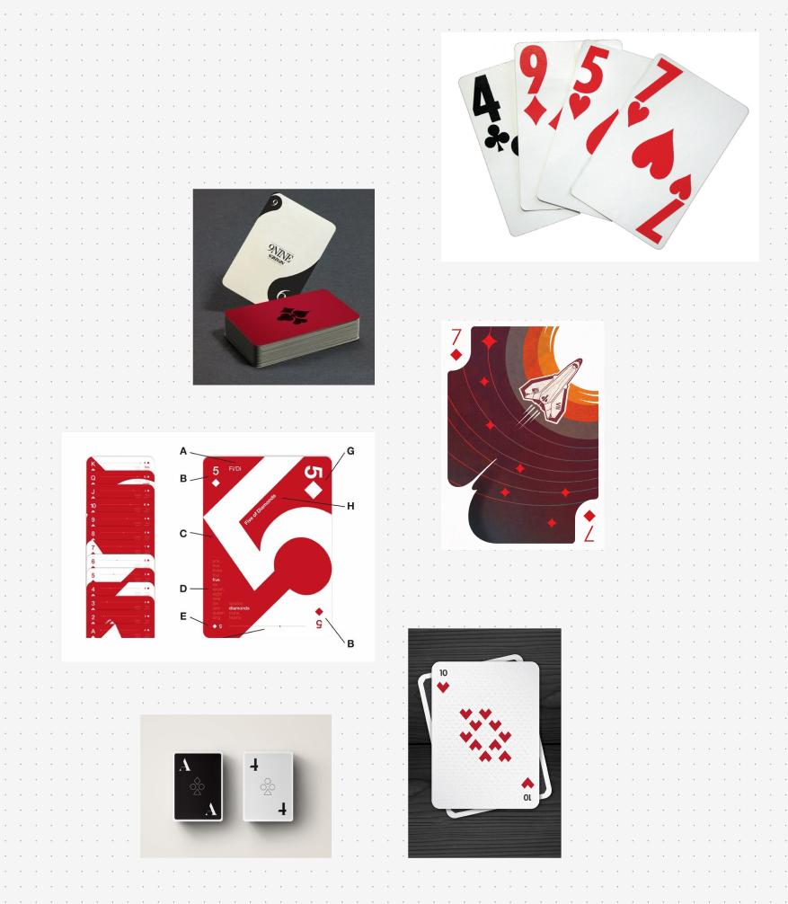
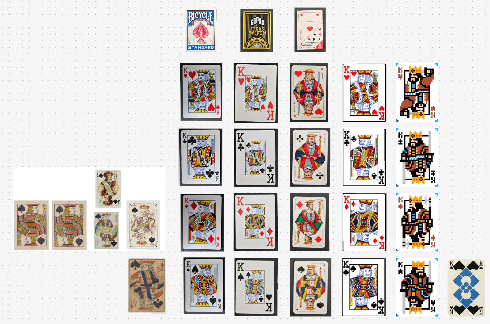
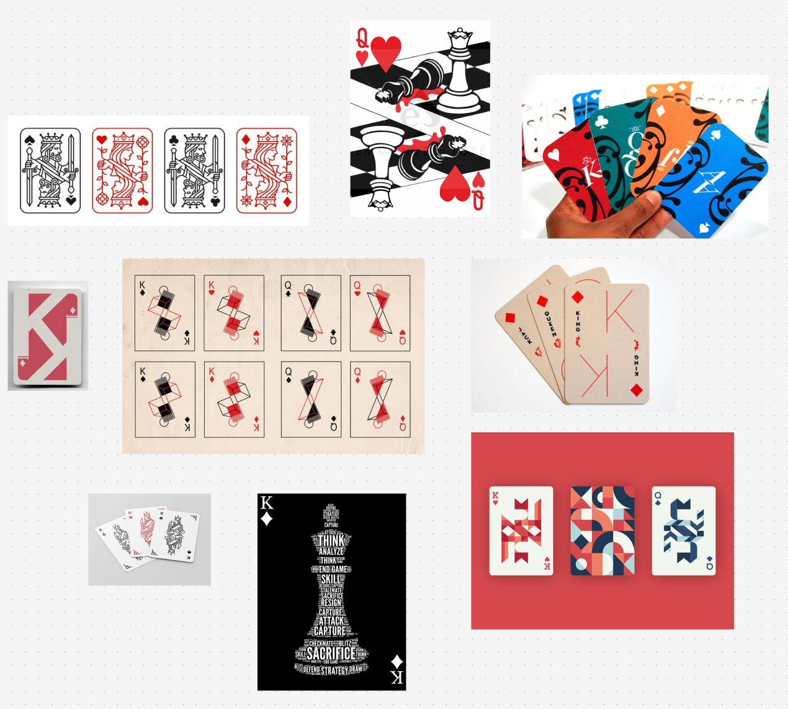
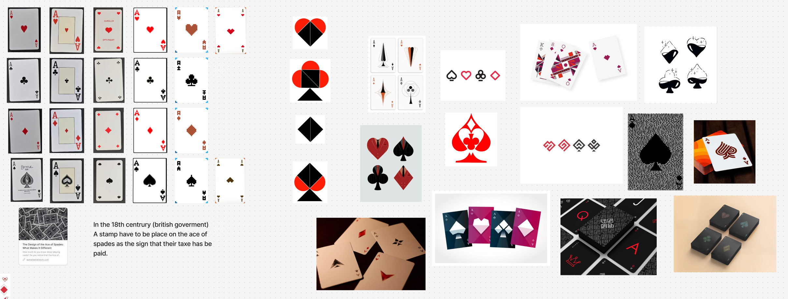
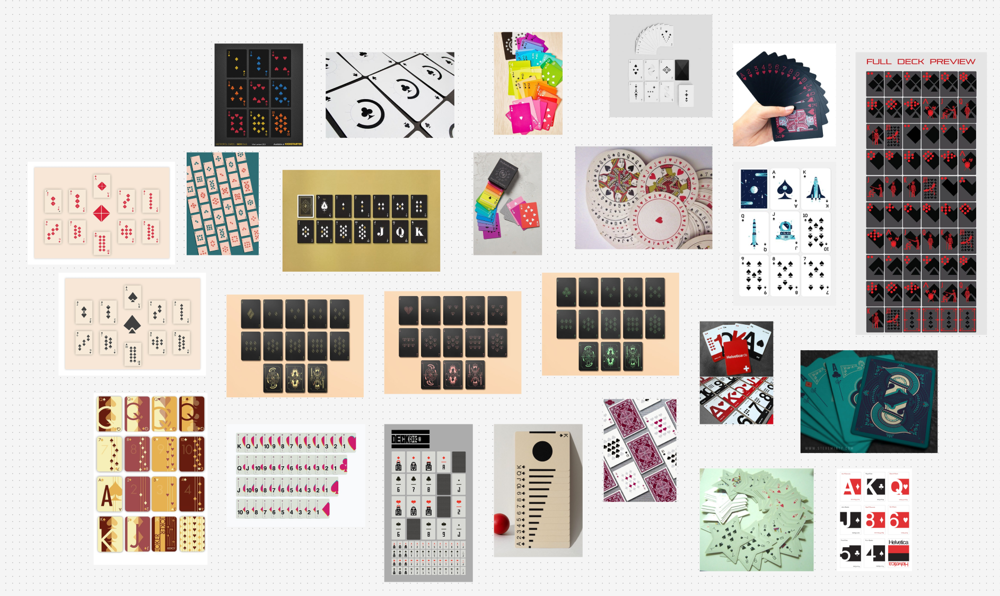
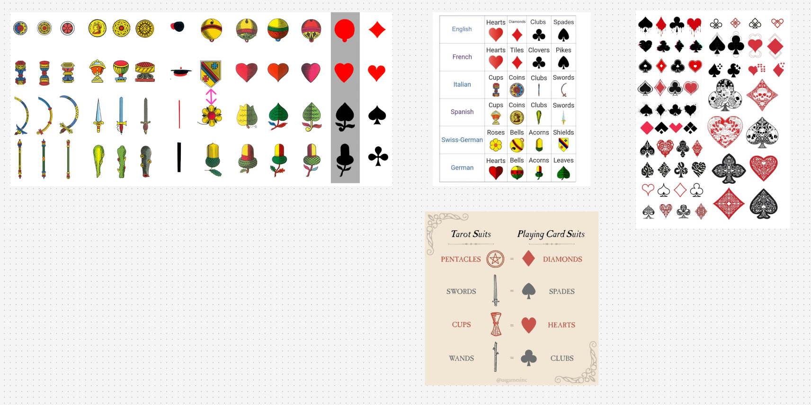

# Visual Research

A visual research based on cards designs has been made by exploring Pinterest. The insights of this research can be found here: [concept-2025-10-02](../../concept-2025-10-02.md)

## Board figma

To see the designs and categories them I put them into a Figma board, here are some screenshots of it:

<table>
   <tr>
       <td align="center">
           
       </td>
       <td align="center">
           
       </td>
       <td align="center">
           
       </td>
   </tr>
   <tr>
         <td align="center">
              
         </td>
         <td align="center">
              
         </td>
         <td align="center">
              
         </td>
    </tr>
</table>