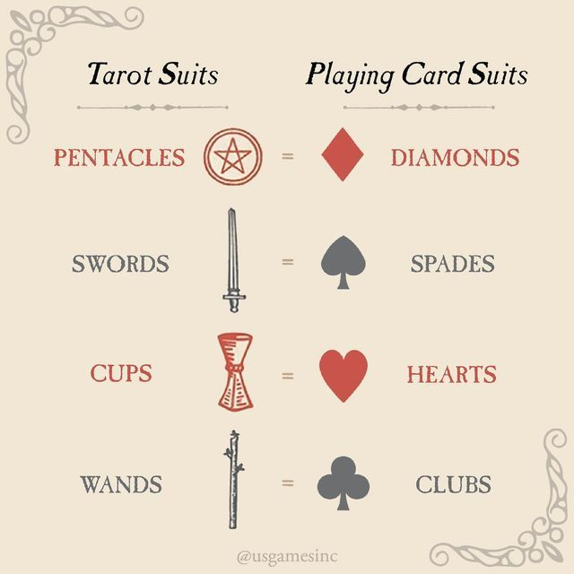
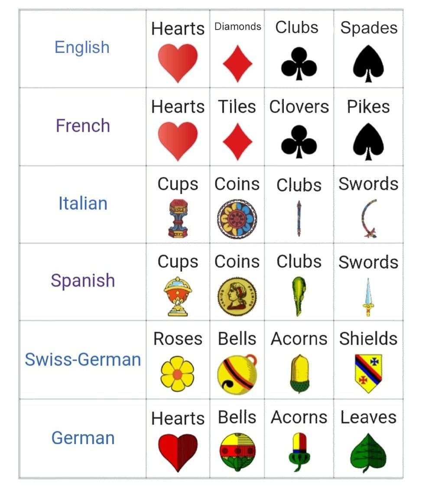

# Parameter Cards idea

These are the parameters to define the cards that we can use to create different designs.

- Mirrored
  - yes
  - no
- Form
  - Square
  - Rectangle
  - Round
  - Triangle
  - Star
- Size
  - Tarot (60x113mm)
  - Jass (57x89mm)
  - Piquet
  - Poker (63x89mm)
- Period
  - from 1300 to 2026
- Border (distance)
- Suits
  - 
  - 
- Color
- Background color
- Border color
- Back
  - Border or not
  - Color
- Thickness
- Corner
- Position of the suits
- Type of representation
  - Text
  - Number / abréviation
  - Suits