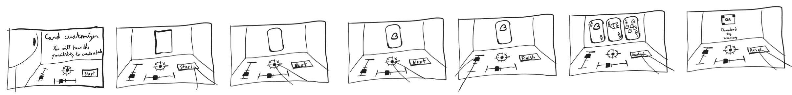

# Luca CORREIA DA ROCHA

## Research
The research focused on visualizing how the design of the different cards have evolved over time and the possibilities of creating new ones.

- Over time the design of the cards has changed a lot, from complex illustrations to more minimalistic designs.
    
    
- Nowadays, people are creating their own cards with unique designs, either by staying minimalistic or going for more complex illustrations based on the simple ones.
    
    
- With this variety of designs, we would like to create our own.

## Designed cards
The idea is to create an interactive installation where users can design their own playing cards by choosing different parameters such as shape, size, color, and design elements. The installation will then generate a unique deck of cards based on the user's choices, allowing them to explore the evolution of card design and create something personal and unique.

## Keyword
Personalized

## User Journey
1. People come to the installation
2. Onboarding
   - explication of the experience
3. Discover
   - users use sliders to change the appearance of a card
4. Choose
   - users choose their favorite appearance from the discovery
5. Receive
   - users receive by mail a pdf of the deck of cards with their design

## Novel Combinations
- Choose
- Hand
- Deck