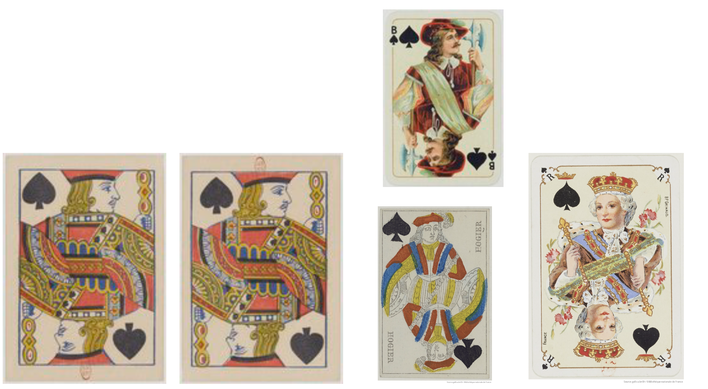

# Team “Builder”

## Research

We are researching how playing cards — from their medieval origins to contemporary trading card games — embody evolving layers of cultural symbolism, mechanics, and visual identities, and how their historical transformations can inspire the creation of new hybrid cards that reveal hidden narratives about history, play, and imagination.

1. Over time, both the design and the rules of playing cards have evolved significantly — from richly detailed illustrations to minimalist aesthetics, and from simple sets of rules to more complex systems of play.
    
    

    

    

2. Today, people design their own cards, exploring a wide range of styles — from minimal compositions to elaborate illustrations that reinterpret the classic designs.

    

    

3. The initial inspiration arose from the memory of the performative gesture of summoning a card in *Yu-Gi-Oh!*, which gradually evolved into a desire to invent and design our own set of cards — eventually leading to the creation of a system where anyone could design their own.

    

4. Online, numerous card and deck builders already exist — some oriented toward fantasy-themed designs, others focused on simpler layouts or direct printing options. However, many of these platforms remain poorly executed, limited in features, or prone to bugs.

    

5. Example of a hybridization between historical and contemporary cards, offering a glimpse of the kinds of creations visitors will generate — even though the final deck builder might focus primarily on classic, traditional card designs.

    

## Card customizer

*Card Customizer* is an interactive installation that lets visitors design their own playing cards by selecting parameters like shape, color, and symbols. Each choice generates a unique deck, turning the history of card design into a creative, hands-on experience. The installation bridges museum artifact and design tool, inviting users to explore centuries of visual evolution through play.

## Keyword

Customize

## User Journey

### More detailed user journey

1. Start / Onboarding Page

    - Visitors arrive at the installation.
    - The interface introduces the concept: “Create your own custom deck of cards.”
    - A short explanation shows how design evolved through history and how visitors will explore it.
    - A “Start” or “Begin” button invites them to interact.

2. Customization Interface

    - Visitors slide through different centuries, discovering how card designs, shapes, and suits evolved over time.
    - Each century offers historical elements (symbols, borders, colors, figures).
    - Visitors select elements they like.
    - They drag and drop these onto a blank card template to design their own card.
    - They can also merge with generative AI some of those symbols into a visual hybridization, to then put it on the card

3. Deck Creation

    - When satisfied with their design, visitors click “Create Deck.”
    - The installation generates a unique deck based on the chosen elements.
    - A visual preview of the deck appears, showing how their selections blend across eras.

4. Result / Deck Overview

   - The full deck is displayed on screen with short historical context (“Your deck combines 18th-century French suits and 20th-century color palettes”).
    - A QR code appears for download.

5. Takeaway

    - Visitors click “Print QR” to receive a small printed card with their QR code.
    - The QR lets them download or print their deck later — a digital and physical souvenir.
    - The system resets to the onboarding page for the next visitor.

#### Experience Summary

Visitors move from observation → creation → reflection → souvenir. They not only design cards but also learn the evolution of visual codes through an intuitive, playful process — turning history into an act of creation.

## Novel Combinations

- Observe
- Create
- Merge